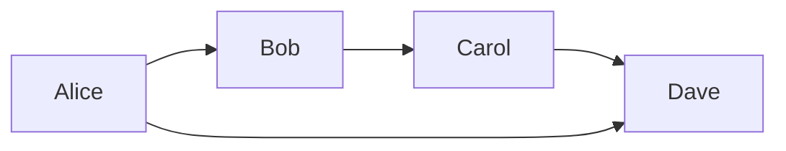

# Column Layout Test

*Testing column-span behaviour in WeasyPrint — comprehensive.*

## Section 1: Normal Two-Column Flow

This is normal two-column body text. Lorem ipsum dolor sit amet, consectetur adipiscing elit. Sed do eiusmod tempor incididunt ut labore et dolore magna aliqua. Ut enim ad minim veniam, quis nostrud exercitation ullamco laboris nisi ut aliquip ex ea commodo consequat. Duis aute irure dolor in reprehenderit in voluptate velit esse cillum dolore eu fugiat nulla pariatur.

More two-column text. Excepteur sint occaecat cupidatat non proident, sunt in culpa qui officia deserunt mollit anim id est laborum. Sed ut perspiciatis unde omnis iste natus error sit voluptatem accusantium doloremque laudantium.

## Section 2: Bare Markdown Table (no wrapper)

Two-column text before the table.

| Actor | Role | Confidence |
|-------|------|------------|
| Alice | Lead analyst | High |
| Bob   | Support | Medium |
| Carol | Field officer | Low |
| Dave  | Coordinator | High |

Two-column text after the bare table. Lorem ipsum dolor sit amet, consectetur adipiscing elit.

## Section 3: Bare Markdown Image (no wrapper — stays column-width)

Two-column text before the image.

Two-column text after the bare image. Lorem ipsum dolor sit amet, consectetur adipiscing elit.

## Section 3e: WORKING single-column image (raw HTML img + div.single-column)

Two-column text before the div. This is the canonical working pattern for full-width images.

Fig. 1 — This image spans the full page width using raw HTML img inside div.single-column.

Two-column text resumes here after the full-width image. Lorem ipsum dolor sit amet, consectetur adipiscing elit. Sed do eiusmod tempor incididunt ut labore et dolore magna aliqua.

## Section 3b: Markdown image inside div.single-column (EXPECTED FAIL)

Two-column text before the div.

Two-column text after the div. Lorem ipsum dolor sit amet, consectetur adipiscing elit.

## Section 3c: Raw HTML img inside div.single-column (EXPECTED PASS — full width)

Two-column text before the div.

<em>Caption: this image should be full width.</em>

Two-column text after the div. Lorem ipsum dolor sit amet, consectetur adipiscing elit.

## Section 3d: Raw HTML img inside div.full-width (EXPECTED PASS — full width, two-col resumes)

Two-column text before the div.

<em>Caption: div.full-width — two-column flow should resume after.</em>

Two-column text after the div. Lorem ipsum dolor sit amet, consectetur adipiscing elit.

## Section 4: HTML table inside div.single-column

Two-column text before the div.

<table>
<thead><tr><th>Actor</th><th>Role</th><th>Notes</th></tr></thead>
<tbody>
<tr><td>Alice</td><td>Lead analyst</td><td>Section 4 — HTML table inside div.single-column</td></tr>
<tr><td>Bob</td><td>Support</td><td>This table is raw HTML, not Markdown</td></tr>
<tr><td>Carol</td><td>Field officer</td><td>Should span full width</td></tr>
<tr><td>Dave</td><td>Coordinator</td><td>And text after should return to two columns</td></tr>
</tbody>
</table>

This prose is also inside div.single-column — should be full width. Lorem ipsum dolor sit amet.

Two-column text after the div. Lorem ipsum dolor sit amet, consectetur adipiscing elit. Sed do eiusmod tempor incididunt ut labore et dolore magna aliqua.

## Section 5: HTML table inside div.full-width

Two-column text before the div.

<table>
<thead><tr><th>Actor</th><th>Role</th><th>Notes</th></tr></thead>
<tbody>
<tr><td>Alice</td><td>Lead analyst</td><td>Section 5 — HTML table inside div.full-width</td></tr>
<tr><td>Bob</td><td>Support</td><td>This table is raw HTML, not Markdown</td></tr>
<tr><td>Carol</td><td>Field officer</td><td>Should span full width</td></tr>
<tr><td>Dave</td><td>Coordinator</td><td>Two-column flow should resume after the div</td></tr>
</tbody>
</table>

Two-column text after the div. Lorem ipsum dolor sit amet, consectetur adipiscing elit. Sed do eiusmod tempor incididunt ut labore et dolore magna aliqua.

## Section 6: Mermaid diagram (no wrapper)

Two-column text before the diagram.

Two-column text after the diagram. Lorem ipsum dolor sit amet, consectetur adipiscing elit.

## Section 7: Mermaid diagram inside div.single-column

Two-column text before the div.

This prose is inside div.single-column before the diagram. Lorem ipsum dolor sit amet.

This prose is inside div.single-column after the diagram. Lorem ipsum dolor sit amet.

Two-column text after the div. Lorem ipsum dolor sit amet, consectetur adipiscing elit.

## Section 8: Prose-only div.single-column

Two-column text before the div.

This is prose-only content inside div.single-column. No tables, no images, no diagrams. Lorem ipsum dolor sit amet, consectetur adipiscing elit. Sed do eiusmod tempor incididunt ut labore et dolore magna aliqua. Ut enim ad minim veniam, quis nostrud exercitation ullamco laboris nisi ut aliquip ex ea commodo consequat.

- Item one in a list
- Item two in a list
- Item three in a list

More prose after the list. Excepteur sint occaecat cupidatat non proident, sunt in culpa qui officia deserunt mollit anim id est laborum.

Two-column text after the div. Lorem ipsum dolor sit amet, consectetur adipiscing elit.

## Section 9: Key Takeaways box (existing class)

Two-column text before the box.

<h2>Key Takeaways</h2>

<em>Scope note: this is the existing key-takeaways class — should already span full width.</em>

<ul>
<li>Finding one: the bare table in Section 2 works.</li>
<li>Finding two: HTML tables inside divs — see Sections 4 and 5.</li>
<li>Finding three: Mermaid diagrams — see Sections 6 and 7.</li>
</ul>

Two-column text after the box. Lorem ipsum dolor sit amet, consectetur adipiscing elit. Sed do eiusmod tempor incididunt ut labore et dolore magna aliqua.

## Section 10: Two columns confirmed

Final two-column section. Lorem ipsum dolor sit amet, consectetur adipiscing elit. Sed do eiusmod tempor incididunt ut labore et dolore magna aliqua. Ut enim ad minim veniam, quis nostrud exercitation ullamco laboris nisi ut aliquip ex ea commodo consequat. Duis aute irure dolor in reprehenderit in voluptate velit esse cillum dolore eu fugiat nulla pariatur. Excepteur sint occaecat cupidatat non proident.

## Section 11: Large Markdown table inside div.full-width (EXPECTED: full-width, no crash)

Two-column text before the div.

| Actor | Role | Organisation | Notes |
| ----- | ---- | ------------ | ----- |
| Row 01 | Lead analyst | WHO | Long cell content to make rows tall: Lorem ipsum dolor sit amet, consectetur adipiscing elit. Sed do eiusmod tempor. |
| Row 02 | Support | UNAIDS | Long cell content to make rows tall: Lorem ipsum dolor sit amet, consectetur adipiscing elit. Sed do eiusmod tempor. |
| Row 03 | Field officer | CDC | Long cell content to make rows tall: Lorem ipsum dolor sit amet, consectetur adipiscing elit. Sed do eiusmod tempor. |
| Row 04 | Coordinator | ECDC | Long cell content to make rows tall: Lorem ipsum dolor sit amet, consectetur adipiscing elit. Sed do eiusmod tempor. |
| Row 05 | Director | NIH | Long cell content to make rows tall: Lorem ipsum dolor sit amet, consectetur adipiscing elit. Sed do eiusmod tempor. |
| Row 06 | Adviser | Wellcome | Long cell content to make rows tall: Lorem ipsum dolor sit amet, consectetur adipiscing elit. Sed do eiusmod tempor. |
| Row 07 | Researcher | EcoHealth | Long cell content to make rows tall: Lorem ipsum dolor sit amet, consectetur adipiscing elit. Sed do eiusmod tempor. |
| Row 08 | Analyst | DARPA | Long cell content to make rows tall: Lorem ipsum dolor sit amet, consectetur adipiscing elit. Sed do eiusmod tempor. |
| Row 09 | Observer | State Dept | Long cell content to make rows tall: Lorem ipsum dolor sit amet, consectetur adipiscing elit. Sed do eiusmod tempor. |
| Row 10 | Consultant | WEF | Long cell content to make rows tall: Lorem ipsum dolor sit amet, consectetur adipiscing elit. Sed do eiusmod tempor. |
| Row 11 | Lead analyst | WHO | Long cell content to make rows tall: Lorem ipsum dolor sit amet, consectetur adipiscing elit. Sed do eiusmod tempor. |
| Row 12 | Support | UNAIDS | Long cell content to make rows tall: Lorem ipsum dolor sit amet, consectetur adipiscing elit. Sed do eiusmod tempor. |
| Row 13 | Field officer | CDC | Long cell content to make rows tall: Lorem ipsum dolor sit amet, consectetur adipiscing elit. Sed do eiusmod tempor. |
| Row 14 | Coordinator | ECDC | Long cell content to make rows tall: Lorem ipsum dolor sit amet, consectetur adipiscing elit. Sed do eiusmod tempor. |
| Row 15 | Director | NIH | Long cell content to make rows tall: Lorem ipsum dolor sit amet, consectetur adipiscing elit. Sed do eiusmod tempor. |
| Row 16 | Adviser | Wellcome | Long cell content to make rows tall: Lorem ipsum dolor sit amet, consectetur adipiscing elit. Sed do eiusmod tempor. |
| Row 17 | Researcher | EcoHealth | Long cell content to make rows tall: Lorem ipsum dolor sit amet, consectetur adipiscing elit. Sed do eiusmod tempor. |
| Row 18 | Analyst | DARPA | Long cell content to make rows tall: Lorem ipsum dolor sit amet, consectetur adipiscing elit. Sed do eiusmod tempor. |
| Row 19 | Observer | State Dept | Long cell content to make rows tall: Lorem ipsum dolor sit amet, consectetur adipiscing elit. Sed do eiusmod tempor. |
| Row 20 | Consultant | WEF | Long cell content to make rows tall: Lorem ipsum dolor sit amet, consectetur adipiscing elit. Sed do eiusmod tempor. |

Two-column text resumes after Section 11. Lorem ipsum dolor sit amet, consectetur adipiscing elit.

## Section 12: Large Markdown table inside div.single-column (EXPECTED: single-column, no crash)

Two-column text before the div.

| Actor | Role | Organisation | Notes |
| ----- | ---- | ------------ | ----- |
| Row 01 | Lead analyst | WHO | Long cell content to make rows tall: Lorem ipsum dolor sit amet, consectetur adipiscing elit. Sed do eiusmod tempor. |
| Row 02 | Support | UNAIDS | Long cell content to make rows tall: Lorem ipsum dolor sit amet, consectetur adipiscing elit. Sed do eiusmod tempor. |
| Row 03 | Field officer | CDC | Long cell content to make rows tall: Lorem ipsum dolor sit amet, consectetur adipiscing elit. Sed do eiusmod tempor. |
| Row 04 | Coordinator | ECDC | Long cell content to make rows tall: Lorem ipsum dolor sit amet, consectetur adipiscing elit. Sed do eiusmod tempor. |
| Row 05 | Director | NIH | Long cell content to make rows tall: Lorem ipsum dolor sit amet, consectetur adipiscing elit. Sed do eiusmod tempor. |
| Row 06 | Adviser | Wellcome | Long cell content to make rows tall: Lorem ipsum dolor sit amet, consectetur adipiscing elit. Sed do eiusmod tempor. |
| Row 07 | Researcher | EcoHealth | Long cell content to make rows tall: Lorem ipsum dolor sit amet, consectetur adipiscing elit. Sed do eiusmod tempor. |
| Row 08 | Analyst | DARPA | Long cell content to make rows tall: Lorem ipsum dolor sit amet, consectetur adipiscing elit. Sed do eiusmod tempor. |
| Row 09 | Observer | State Dept | Long cell content to make rows tall: Lorem ipsum dolor sit amet, consectetur adipiscing elit. Sed do eiusmod tempor. |
| Row 10 | Consultant | WEF | Long cell content to make rows tall: Lorem ipsum dolor sit amet, consectetur adipiscing elit. Sed do eiusmod tempor. |
| Row 11 | Lead analyst | WHO | Long cell content to make rows tall: Lorem ipsum dolor sit amet, consectetur adipiscing elit. Sed do eiusmod tempor. |
| Row 12 | Support | UNAIDS | Long cell content to make rows tall: Lorem ipsum dolor sit amet, consectetur adipiscing elit. Sed do eiusmod tempor. |
| Row 13 | Field officer | CDC | Long cell content to make rows tall: Lorem ipsum dolor sit amet, consectetur adipiscing elit. Sed do eiusmod tempor. |
| Row 14 | Coordinator | ECDC | Long cell content to make rows tall: Lorem ipsum dolor sit amet, consectetur adipiscing elit. Sed do eiusmod tempor. |
| Row 15 | Director | NIH | Long cell content to make rows tall: Lorem ipsum dolor sit amet, consectetur adipiscing elit. Sed do eiusmod tempor. |
| Row 16 | Adviser | Wellcome | Long cell content to make rows tall: Lorem ipsum dolor sit amet, consectetur adipiscing elit. Sed do eiusmod tempor. |
| Row 17 | Researcher | EcoHealth | Long cell content to make rows tall: Lorem ipsum dolor sit amet, consectetur adipiscing elit. Sed do eiusmod tempor. |
| Row 18 | Analyst | DARPA | Long cell content to make rows tall: Lorem ipsum dolor sit amet, consectetur adipiscing elit. Sed do eiusmod tempor. |
| Row 19 | Observer | State Dept | Long cell content to make rows tall: Lorem ipsum dolor sit amet, consectetur adipiscing elit. Sed do eiusmod tempor. |
| Row 20 | Consultant | WEF | Long cell content to make rows tall: Lorem ipsum dolor sit amet, consectetur adipiscing elit. Sed do eiusmod tempor. |

Two-column text resumes after Section 12. Lorem ipsum dolor sit amet, consectetur adipiscing elit.

## Section 13: Large standalone Markdown table (EXPECTED: full-width span, no crash)

Two-column text before the table. No div wrapper — the table CSS applies column-span:all directly.

| Actor | Role | Organisation | Notes |
| ----- | ---- | ------------ | ----- |
| Row 01 | Lead analyst | WHO | Long cell content to make rows tall: Lorem ipsum dolor sit amet, consectetur adipiscing elit. Sed do eiusmod tempor. |
| Row 02 | Support | UNAIDS | Long cell content to make rows tall: Lorem ipsum dolor sit amet, consectetur adipiscing elit. Sed do eiusmod tempor. |
| Row 03 | Field officer | CDC | Long cell content to make rows tall: Lorem ipsum dolor sit amet, consectetur adipiscing elit. Sed do eiusmod tempor. |
| Row 04 | Coordinator | ECDC | Long cell content to make rows tall: Lorem ipsum dolor sit amet, consectetur adipiscing elit. Sed do eiusmod tempor. |
| Row 05 | Director | NIH | Long cell content to make rows tall: Lorem ipsum dolor sit amet, consectetur adipiscing elit. Sed do eiusmod tempor. |
| Row 06 | Adviser | Wellcome | Long cell content to make rows tall: Lorem ipsum dolor sit amet, consectetur adipiscing elit. Sed do eiusmod tempor. |
| Row 07 | Researcher | EcoHealth | Long cell content to make rows tall: Lorem ipsum dolor sit amet, consectetur adipiscing elit. Sed do eiusmod tempor. |
| Row 08 | Analyst | DARPA | Long cell content to make rows tall: Lorem ipsum dolor sit amet, consectetur adipiscing elit. Sed do eiusmod tempor. |
| Row 09 | Observer | State Dept | Long cell content to make rows tall: Lorem ipsum dolor sit amet, consectetur adipiscing elit. Sed do eiusmod tempor. |
| Row 10 | Consultant | WEF | Long cell content to make rows tall: Lorem ipsum dolor sit amet, consectetur adipiscing elit. Sed do eiusmod tempor. |
| Row 11 | Lead analyst | WHO | Long cell content to make rows tall: Lorem ipsum dolor sit amet, consectetur adipiscing elit. Sed do eiusmod tempor. |
| Row 12 | Support | UNAIDS | Long cell content to make rows tall: Lorem ipsum dolor sit amet, consectetur adipiscing elit. Sed do eiusmod tempor. |
| Row 13 | Field officer | CDC | Long cell content to make rows tall: Lorem ipsum dolor sit amet, consectetur adipiscing elit. Sed do eiusmod tempor. |
| Row 14 | Coordinator | ECDC | Long cell content to make rows tall: Lorem ipsum dolor sit amet, consectetur adipiscing elit. Sed do eiusmod tempor. |
| Row 15 | Director | NIH | Long cell content to make rows tall: Lorem ipsum dolor sit amet, consectetur adipiscing elit. Sed do eiusmod tempor. |
| Row 16 | Adviser | Wellcome | Long cell content to make rows tall: Lorem ipsum dolor sit amet, consectetur adipiscing elit. Sed do eiusmod tempor. |
| Row 17 | Researcher | EcoHealth | Long cell content to make rows tall: Lorem ipsum dolor sit amet, consectetur adipiscing elit. Sed do eiusmod tempor. |
| Row 18 | Analyst | DARPA | Long cell content to make rows tall: Lorem ipsum dolor sit amet, consectetur adipiscing elit. Sed do eiusmod tempor. |
| Row 19 | Observer | State Dept | Long cell content to make rows tall: Lorem ipsum dolor sit amet, consectetur adipiscing elit. Sed do eiusmod tempor. |
| Row 20 | Consultant | WEF | Long cell content to make rows tall: Lorem ipsum dolor sit amet, consectetur adipiscing elit. Sed do eiusmod tempor. |

Two-column text resumes after Section 13. Lorem ipsum dolor sit amet, consectetur adipiscing elit.

## Section 14: Footnote rendering tests

### 14a: Footnote in normal flow (EXPECTED: superscript number)

This sentence has a footnote in normal two-column flow.[^fn-normal] And this sentence has a second footnote also in normal flow.[^fn-normal2]

### 14b: Same footnote key used twice (EXPECTED: both render as superscript)

First use of a repeated key.[^fn-repeat] Some text between. Second use of the same key.[^fn-repeat]

### 14c: Footnote inside pull-quote (EXPECTED: superscript in blockquote)

| "This is a pull-quote with a footnote ref inside it."[^fn-pullquote]
| source: Test source, 2024.

Text after the pull-quote with a ref to the same key.[^fn-pullquote]

### 14d: Footnote ref inside div.single-column (EXPECTED: superscript)

This text is inside div.single-column and has a footnote.[^fn-in-div] The ref should render as a superscript number, not as literal text.

Text after the div with same key.[^fn-in-div]

### 14e: Footnote ref inside div.full-width (EXPECTED: superscript)

This text is inside div.full-width and has a footnote.[^fn-in-fw] The ref should render as a superscript number.

Text after the div. Lorem ipsum dolor sit amet.

### 14f: Image in normal flow (EXPECTED: visible, column-width)

This is text before a Markdown image in normal flow.

Text after the image.

### 14g: Image inside div.single-column (EXPECTED: visible, full-width)

Text after the div. Lorem ipsum.

[^fn-normal]: This is the footnote definition for Section 14a — normal flow.
[^fn-normal2]: This is the second footnote definition for Section 14a.
[^fn-repeat]: This footnote is referenced twice in Section 14b.
[^fn-pullquote]: This footnote is referenced inside a pull-quote and after it in Section 14c.
[^fn-in-div]: This footnote is referenced inside div.single-column and after it in Section 14d.
[^fn-in-fw]: This footnote is referenced inside div.full-width and after it in Section 14e.
